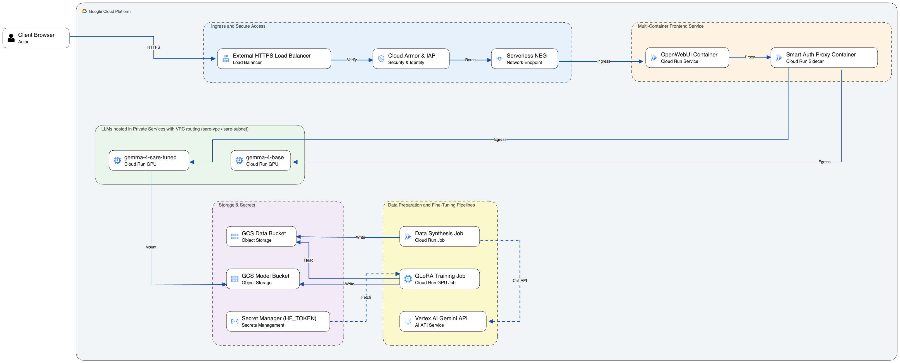

# Serverless LLM Blueprint: Fine-Tuning & Serving Gemma 4 on Cloud Run

A Google-recommended reference architecture for fine-tuning, mounting, and securely serving open LLMs (Gemma 4 12B) on Google Cloud Run using vLLM, GCS FUSE, Cloud Armor, and Identity-Aware Proxy (IAP).

---

## Architecture Overview

This blueprint provides an enterprise-grade, cost-effective alternative to cloud AI APIs by giving organizations total sovereignty over their models and data.



```
[ PDF Documents ] ---> [ Cloud Run Data Synthesis Job (Gemini API) ] ---> [ JSONL Training Dataset ]
                                  (sa: sare-synth)                                  |
                                                                                    v
[ vLLM Serving (Cloud Run GPU + GCS FUSE) ] <--- [ Tuned LoRA Adapter ] <--- [ Cloud Run QLoRA Training Job ]
         (sa: sare-backend)                                                        (sa: sare-backend)
         ^
         | (Private VPC Egress via sare-subnet + IAM Auth)
[ OpenWebUI + Smart Auth Proxy (Multi-Container Cloud Run) ] <--- [ Load Balancer + Cloud Armor + IAP ]
         (sa: sare-frontend)
```

---

## Repository Structure

```
.
├── README.md               # Main project documentation & getting started guide
├── .env.example            # Environment variable template
├── .env                    # Local environment config (git-ignored)
├── assets/
│   └── blueprint_diagram.png# High-resolution Google Cloud architecture diagram
├── docs/
│   └── HOWTO.md            # Step-by-step developer execution guide
├── scripts/
│   ├── setup_iam.sh            # IAM 4-SA Security setup script
│   ├── setup_storage.sh        # Dual GCS Buckets, Artifact Registry, Secrets setup script
│   ├── setup_network.sh        # Custom VPC & Subnet with Private Google Access script
│   ├── deploy_synthesis_job.sh # Build & deploy Cloud Run Data Synthesis Job
│   ├── deploy_finetuning_job.sh# Build & deploy Cloud Run QLoRA Fine-Tuning GPU Job
│   ├── deploy_model_service.sh # Build & deploy Private vLLM Cloud Run GPU Serving
│   ├── deploy_frontend.sh      # Deploy Multi-Container OpenWebUI + Auth Proxy Frontend
│   ├── setup_ingress.sh        # Provision Load Balancer, SSL Cert, Cloud Armor & IAP
│   └── setup_observability.sh  # Provision Cloud Monitoring LLM Dashboard
└── src/
    ├── train/
    │   ├── Dockerfile          # Data generator container build spec
    │   ├── cloudbuild.yaml     # Cloud Build pipeline for synthesis container & Cloud Run Job deploy
    │   ├── config.json         # Meta-prompts & domain expert instruction templates
    │   ├── generate_dataset.py # Gemini API PDF-to-JSONL generator with Pydantic validation
    │   └── requirements.txt    # Python dependencies
    ├── finetuning/
    │   ├── Dockerfile          # PyTorch CUDA 12.8 GPU container build spec
    │   ├── cloudbuild.yaml     # Cloud Build pipeline for QLoRA GPU training job
    │   ├── train_lora.py       # 4-bit QLoRA trainer (TRL SFTTrainer & PEFT) with auto-redeploy
    │   └── requirements.txt    # Python ML dependencies (transformers, peft, trl, bitsandbytes)
    ├── serve/
    │   ├── Dockerfile          # PyTorch + vLLM OpenAI-compatible server build spec
    │   ├── cloudbuild.yaml     # Cloud Build pipeline for private GPU model serving service
    │   └── serve.sh            # vLLM startup wrapper with GCS FUSE LoRA adapter detection
    └── frontend/
        ├── service.yaml        # Declarative Knative multi-container service manifest
        ├── cloudbuild.yaml     # Cloud Build pipeline for auth-proxy & OpenWebUI tagging
        └── auth-proxy/
            ├── Dockerfile      # Python 3.12 slim auth proxy build spec
            ├── main.py         # FastAPI OIDC Token Injector & SSE stream router
            └── requirements.txt# Proxy dependencies (fastapi, uvicorn, httpx)
```

---

## Quick Start Guide

### Prerequisites
- Google Cloud SDK (`gcloud`) installed and authenticated (`gcloud auth login`).
- A GCP project with billing enabled.

### Deployment Steps

1. **Configure Environment**:
   ```bash
   cp .env.example .env
   # Edit .env to set your PROJECT_ID, REGION, and HF_TOKEN
   ```

2. **IAM & Security Setup**:
   ```bash
   chmod +x scripts/setup_iam.sh
   ./scripts/setup_iam.sh
   ```

3. **Storage & Networking Setup**:
   ```bash
   chmod +x scripts/setup_storage.sh scripts/setup_network.sh
   ./scripts/setup_storage.sh
   ./scripts/setup_network.sh
   ```

4. **Upload Source PDFs**:
   ```bash
   source .env
   gcloud storage cp data/*.pdf gs://$DATA_BUCKET/pdf/
   ```

5. **Deploy Data Synthesis & Fine-Tuning Jobs**:
   ```bash
   chmod +x scripts/deploy_synthesis_job.sh scripts/deploy_finetuning_job.sh
   ./scripts/deploy_synthesis_job.sh
   ./scripts/deploy_finetuning_job.sh
   ```

6. **Deploy Serving, Frontend, Ingress & Observability**:
   ```bash
   chmod +x scripts/deploy_model_service.sh scripts/deploy_frontend.sh scripts/setup_ingress.sh scripts/setup_observability.sh
   ./scripts/deploy_model_service.sh
   ./scripts/deploy_frontend.sh
   ./scripts/setup_ingress.sh
   ./scripts/setup_observability.sh
   ```

---

## Documentation Links

* [Step-by-Step HOWTO Guide](docs/HOWTO.md)
